# Fruit Machine
----
**Spin results**

You will receive ten xp for each pair you spin, fifty for a triple, two hundred and fifty for a quadruple and five thousand for a full set. So getting a full set will really boost your score!

**Free spins**

You can gain twenty additional spins every six hours. When you click and gain these additional spins, the countdown starts again for the next six hours. You will soon be able to purchase extra spins with real world money so that you can keep spinning away.

**Score**

The scoring system on this fruit machine is different to many other games in that it is based on your average xp per spin. This prevents the top of the leaderboard from being dominated by people who have simply spent the most time and made the most spins. Instead, people who get good spins will rank highly on the board. There may be tweaks to the scoring algorithm as more players start using the fruit machine since the margin between most players will be very small.

**Stats**

The game tracks every spin you make and the results can be viewed in the stats page along with your account information including level and xp.

**Leaderboard**

The number in blue shows the position of the player. The number in green represents that user’s score. The number in dark grey next to the username (also displayed in the header) represents the user’s level. If the user is logged in when viewing the leaderboard, their entry will be displayed at the very top however if the user is not logged in then this will instead show the entry for the number one player.

----

**Special items**

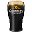

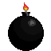

Beer can be used to provide two ‘beer spins’ in which you receive double xp. Beer spins are cumulative; each beer you use adds two beer spins to the beer spins count. You also get an additional two xp from each beer you gain in a spin (before the beer spin multiplier is applied).

When at least one bomb is spun, you do not gain any xp from that spin. If you got any beer from the spin you will not receive those either. For each bomb spun, the number of beers you currently have is reduced. The more bombs that are spun, the more beers you lose with 5 bombs losing all of your beers.

If you gain an additional spins item and there are no bombs in that spin then you will gain however many spins are indicated by the item as well as additional xp of the value of extra spins gained.

**Regular items**

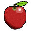
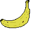
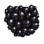
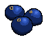
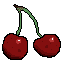
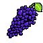

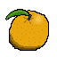
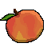

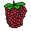

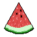
